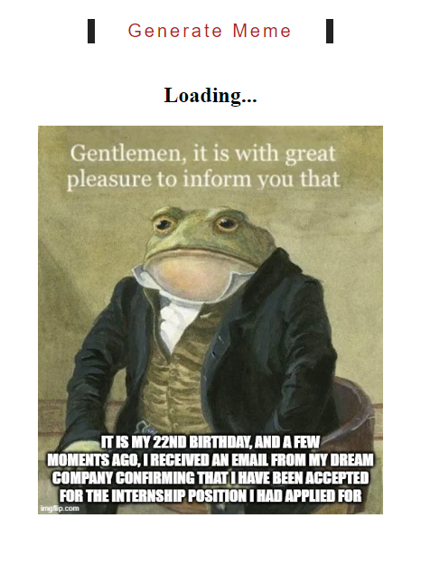

# Meme Generator

## Description

This web application allows you to generate wholesome memes fetched from an external API.

## File Name

`meme_generator.html`

## Features

- Click the "Generate Meme" button to fetch a new wholesome meme.
- The meme will be displayed along with its title and author.

## Technologies Used

- HTML5
- CSS3
- JavaScript

## Usage

1. Click the "Generate Meme" button to fetch a new wholesome meme.
2. The meme will be displayed along with its title and author.

## Preview

## Credits

This project utilizes the "Wholesome Memes" API to fetch memes.

## License

This project is licensed under the MIT License.

_Note: Customize the README file according to your project's specific needs and requirements._
